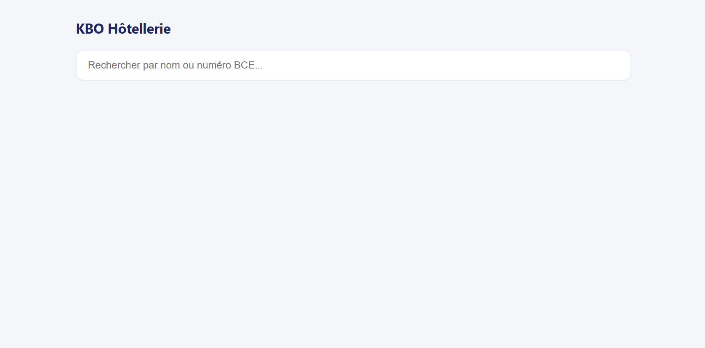
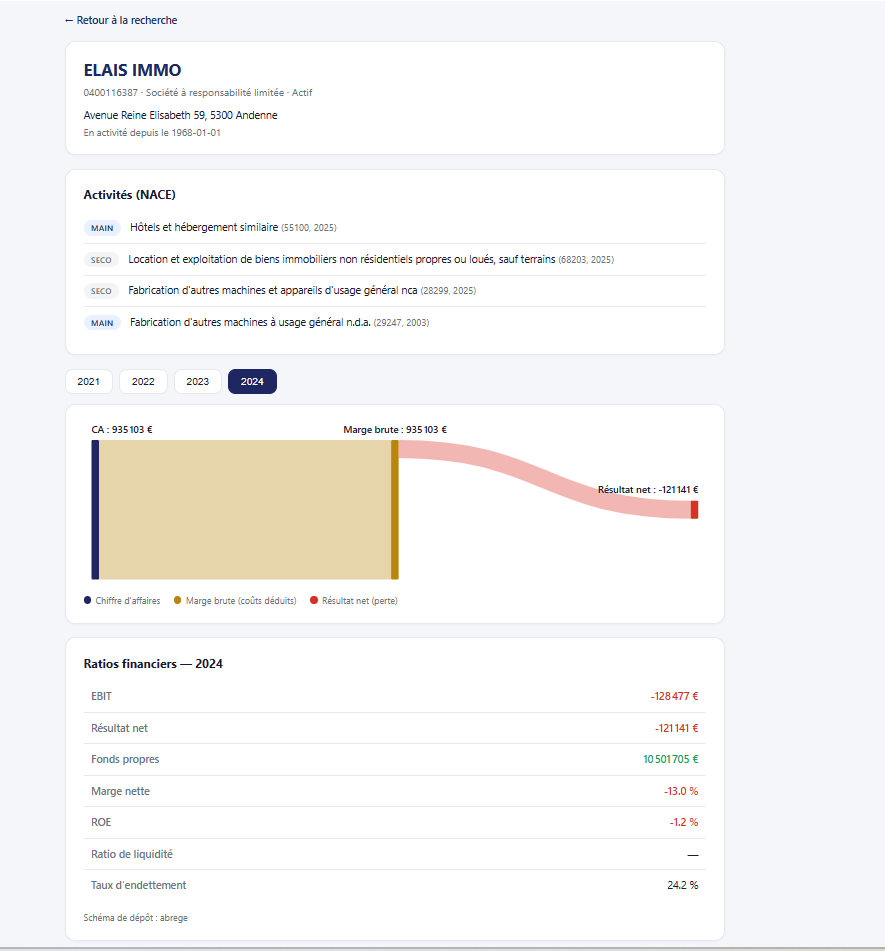
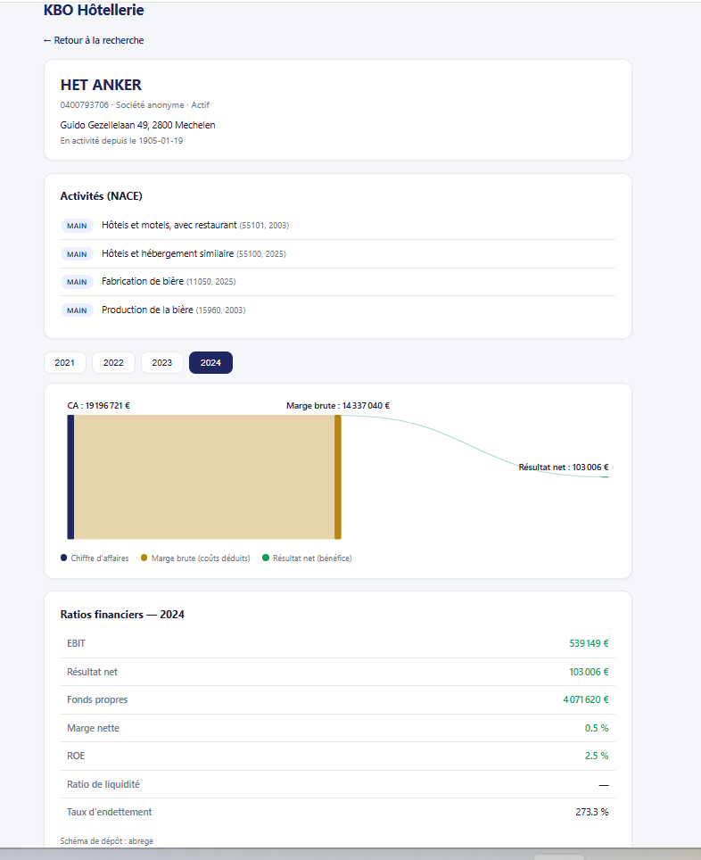
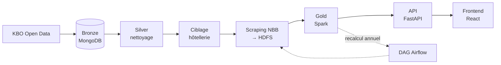

# KBO Hôtellerie — Architecture Big Data

Pipeline data engineering de bout en bout : ingestion de l'intégralité du registre des entreprises belges (KBO Open Data), ciblage et enrichissement financier du secteur hôtelier via les dépôts comptables NBB/CBSO, calcul de ratios financiers, et exposition via une API + interface web de consultation.


---

## Aperçu

**Recherche d'entreprise**


**Fiche entreprise — identité et activités**


**Deuxiéme exemple**


---

## Architecture



Le pipeline suit une architecture médaillon (Bronze / Silver / Gold) :

| Couche | Contenu | Portée |
|---|---|---|
| **Bronze** | Entreprises brutes jointes (identité, adresse, activités, dénominations) | ~1,95M entreprises belges actives |
| **Silver** | Données nettoyées, dédupliquées, labellisées en français | ~1,95M entreprises |
| **Gold** | Ratios financiers calculés par exercice (2021–2025) | 3 592 entreprises du secteur hôtelier |

---

## Stack technique

- **Stockage** : MongoDB (documents), HDFS (fichiers bruts CSV/PDF)
- **Traitement distribué** : Apache Spark (PySpark)
- **Orchestration** : Apache Airflow
- **API** : FastAPI
- **Frontend** : React + Vite + Redux Toolkit + Recharts
- **Infrastructure** : Docker Compose

---

## Structure du projet

```
.
├── docker-compose.yml
├── Dockerfile.airflow          # Image Airflow + Java + PySpark
├── hadoop.env
├── dags/
│   └── hotel_gold_recalc_dag.py    # Recalcul annuel incrémental
├── scripts/
│   ├── import_kbo_enriched.py      # Ingestion Bronze
│   ├── build_enterprise_silver.py  # Nettoyage Silver
│   ├── filter_hotel_targets.py     # Ciblage hôtellerie
│   ├── scrape_nbb_hotels.py        # Scraping NBB (PDF + CSV)
│   ├── scrape_nbb_csv_only.py      # Scraping NBB (CSV uniquement)
│   ├── build_hotel_gold.py         # Calcul Gold (Spark)
│   └── mongo_ingest.py             # Utilitaires StateDB
├── api/
│   ├── main.py                     # API FastAPI
│   └── requirements.txt
├── frontend/
│   ├── package.json
│   ├── vite.config.js
│   └── src/
│       ├── App.jsx
│       ├── store.js
│       ├── features/
│       │   ├── search/              # Vue recherche
│       │   └── entreprise/          # Vue fiche entreprise
│       └── components/
│           └── ResultatSankey.jsx   # Sankey compte de résultat
├── data/                        # KBO Open Data (CSV sources)
└── code.csv                     # Table de labels KBO (FR)
```

---

## Prérequis

- Docker Desktop
- Le dump KBO Open Data (`enterprise.csv` + fichiers annexes) placé dans `./data/KBO/`
- Le fichier `code.csv` (labels FR KBO) placé dans `./data/`

---

## Installation

1. Cloner le dépôt et placer les fichiers KBO Open Data dans `./data/KBO/`

2. Construire l'image Airflow (Java + PySpark) et démarrer l'infrastructure :
   ```bash
   docker compose build airflow-scheduler
   docker compose up -d
   ```

3. Vérifier que tous les services sont up :
   ```bash
   docker compose ps
   ```

Services exposés :

| Service | URL |
|---|---|
| Airflow | http://localhost:8080 (admin / admin) |
| Mongo Express | http://localhost:8081 |
| HDFS NameNode UI | http://localhost:9870 |
| API FastAPI | http://localhost:8000/docs |
| Frontend | http://localhost:5173 |

---

## Utilisation

Le pipeline s'exécute dans l'ordre suivant, chaque étape étant idempotente et reprenable en cas d'interruption (reprise via checkpoints MongoDB `batch_state` / `state_db`).

```bash
# 1. Ingestion Bronze (peut durer plusieurs heures selon le volume)
docker compose exec airflow-scheduler python /opt/airflow/scripts/import_kbo_enriched.py --kbo-dir /opt/airflow/data/KBO

# 2. Nettoyage Silver
docker compose exec airflow-scheduler python /opt/airflow/scripts/build_enterprise_silver.py --code-csv /opt/airflow/data/code.csv

# 3. Ciblage hôtellerie (charge les cibles en StateDB)
docker compose exec airflow-scheduler python /opt/airflow/scripts/filter_hotel_targets.py

# 4. Scraping NBB — CSV, années 2021-2025 (reprend automatiquement en cas d'interruption)
docker compose exec -d airflow-scheduler python /opt/airflow/scripts/scrape_nbb_csv_only.py

# 5. Calcul Gold (Spark)
docker compose exec airflow-scheduler python /opt/airflow/scripts/build_hotel_gold.py
```

Le **DAG Airflow** `hotel_gold_recalc` (déclenchement annuel) automatise ensuite la détection de nouveaux dépôts NBB et le recalcul incrémental de la Gold layer, sans jamais retraiter l'intégralité de la base.

---

## Modèle de données

### `enterprises_rich` (Bronze)
Un document par entreprise, avec sous-tableaux embarqués (`activities`, `addresses`, `denominations`, `contacts`, `establishments`, `branches`) joints depuis les fichiers KBO Open Data.

### `enterprise_silver` (Silver)
Même structure que Bronze, avec :
- Dates normalisées (`YYYY-MM-DD`)
- Activités dédupliquées
- Une seule adresse (siège social, `TypeOfAddress = REGO`)
- Dénomination officielle en tête de liste
- Labels français ajoutés (`status_label`, `juridical_form_label`, `NaceLabel`)

### `hotel_gold` (Gold)
Un document par entreprise hôtelière, avec un tableau `years[]` contenant, par exercice :
- Montants extraits des codes PCMN (chiffre d'affaires, EBIT, résultat net, fonds propres, etc.)
- 5 ratios calculés : marge brute, marge nette, ROE, ratio de liquidité, taux d'endettement
- `schema_type` (full / abrégé / micro) — estimé par heuristique faute de table de correspondance officielle NBB

### `state_db` (StateDB)
Collection de suivi transverse : trace chaque fichier téléchargé (`source`, `year`, `doc_type`, `status`) pour permettre une reprise sans doublon à chaque étape du pipeline.

---

## API

| Endpoint | Description |
|---|---|
| `GET /health` | Statut de l'API |
| `GET /search?q=` | Recherche par nom ou numéro BCE |
| `GET /entreprise/{numero}` | Fiche complète (identité Silver + ratios Gold si disponibles) |

Documentation interactive : http://localhost:8000/docs

---

## Résultats

| Indicateur | Valeur |
|---|---|
| Entreprises Bronze/Silver | 1 951 671 |
| Entreprises ciblées (hôtellerie) | 4 908 |
| Entreprises avec CSV NBB récupérés | 4 904 |
| Fichiers CSV stockés sur HDFS | 18 566 |
| Fiches Gold calculées | 3 592 |

---

## Auteur

Oumou Sow — Master 2 Big Data & IA, IPSSI Montpellier